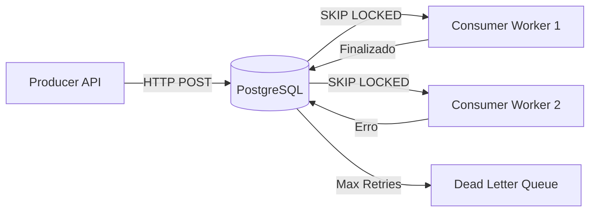

# ResiliQ: Sistema de Filas Distribuídas em Go

ResiliQ é uma implementação acadêmica e prática de um sistema de filas distribuídas de alta performance e resiliência, construído do zero usando Go e PostgreSQL.

## 🚀 Funcionalidades

- **Persistence**: Garantia de que nenhuma mensagem seja perdida através de persistência em PostgreSQL.
- **Concurrency Control**: Utiliza `SELECT FOR UPDATE SKIP LOCKED` para permitir que múltiplos workers processem mensagens simultaneamente sem duplicidade.
- **Idempotency**: Suporte a chaves de idempotência para evitar processamento duplicado de requisições idênticas.
- **Resilience**:
  - Mecanismo de Retry automático.
  - Exponential Backoff para evitar sobrecarga em sistemas externos.
  - **DLQ (Dead Letter Queue)**: Mensagens que falham permanentemente são movidas para uma fila de inspeção manual.
- **Observability**:
  - Logs estruturados em JSON (Zap).
  - Métricas nativas para Prometheus.

## 🏗️ Arquitetura



## 🛠️ Tecnologias

- **Linguagem**: Go (Golang)
- **Banco de Dados**: PostgreSQL 15
- **Observabilidade**: Zap (Logs), Prometheus (Métricas)
- **Infraestrutura**: Docker & Docker Compose

## 🚦 Como Rodar

### Pré-requisitos
- Docker & Docker Compose
- Go 1.21+

### Passo 1: Subir o Banco de Dados
```bash
docker-compose up -d
```

### Passo 2: Rodar o Produtor
```bash
go run cmd/producer/main.go
```

### Passo 3: Rodar o Consumidor
```bash
go run cmd/consumer/main.go
```

## 🧪 Testando os Endpoints

### Enfileirar Mensagem
```bash
curl -X POST http://localhost:9090/enqueue \
     -H "Content-Type: application/json" \
     -d '{"task": "send_welcome_email", "user_id": 123}'
```

### Enfileirar com Idempotência
```bash
curl -X POST http://localhost:9090/enqueue \
     -H "X-Idempotency-Key: unique-key-1" \
     -d '{"task": "process_payment", "amount": 100}'
```

### Ver Métricas
- **Produtor (Enfileiramento)**: `curl http://localhost:9090/metrics`
- **Consumidor (Processamento)**: `curl http://localhost:9091/metrics`